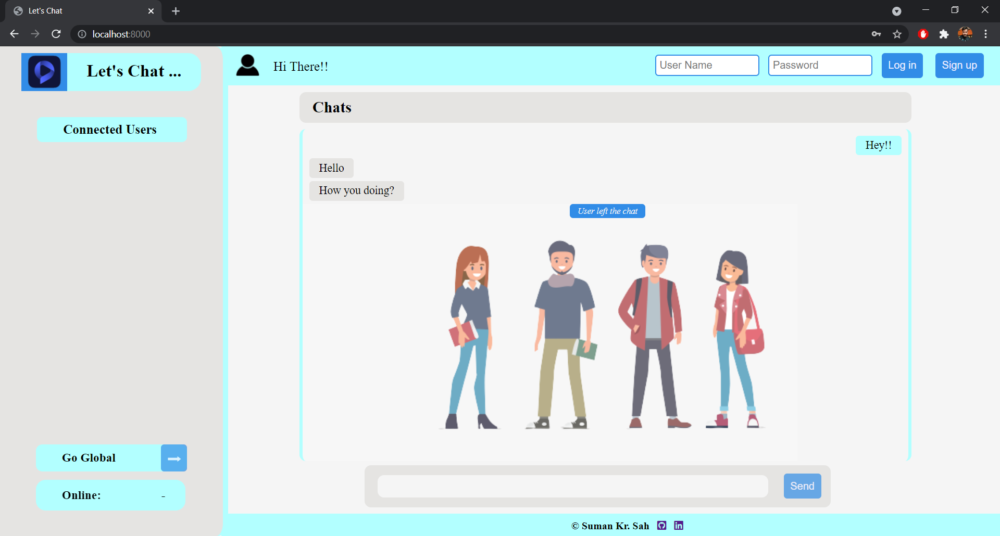
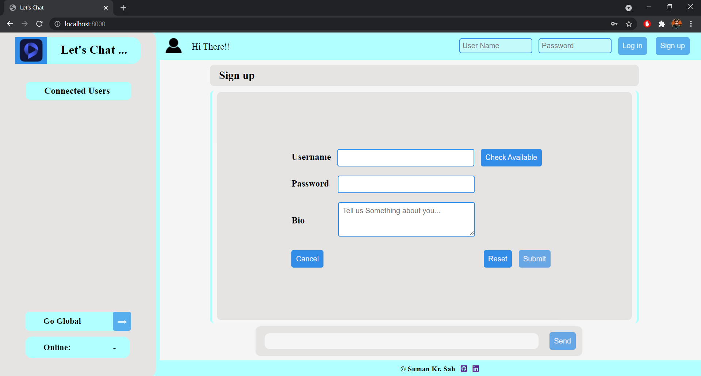
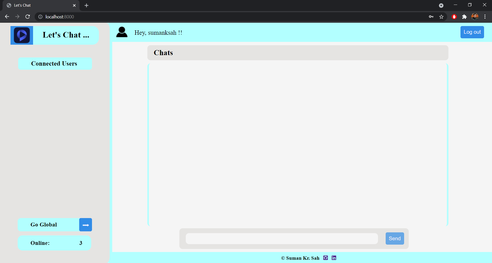
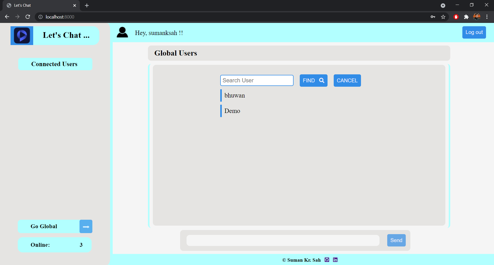
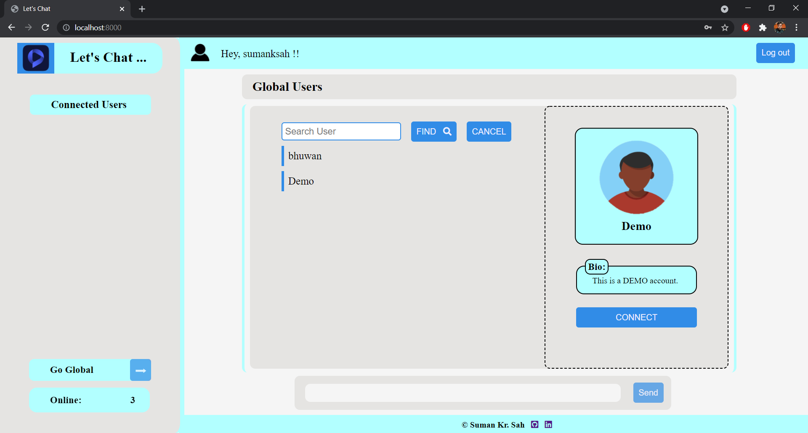
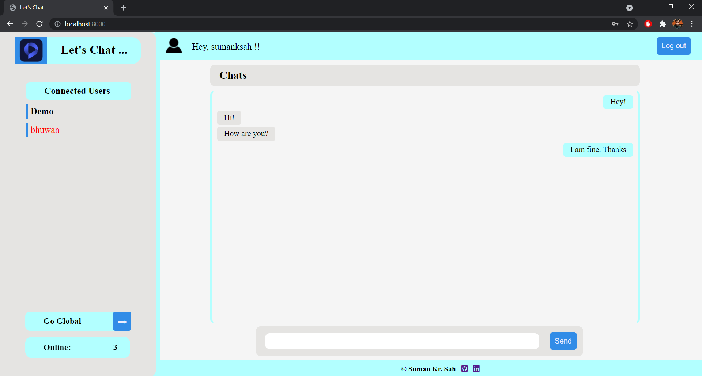

# Let's Chat ...

It's a Real-time chat web-application made using HTML, CSS and JavaScript for Frontend, mongodb for Database and Express.js for Backend.

This is a fully asynchronized website made using vanilla JavaScript(ES6).  
Used fetch api for all the calls made to the server.   

Check this out: **[https://letsconnect-vimalbhadra.herokuapp.com/](https://letsconnect-vimalbhadra.herokuapp.com/)**  

## Libraries Used: 
&emsp; 1. mongodb - for handling CRUD operation  
&emsp; 2. socket.io - for handling different sockets (users).

## Way to use it:
&emsp; * Make an account from the signup page.  
&emsp; * Login with the same credentials from the home page.  
&emsp; * Click on Go Global Button and select the user.  
&emsp; * Click on Connect Button, this will add user to the list.  
&emsp; * Click on the User with whom you want to talk, from the sideNav bar.  
&emsp; * And Enjoy!!
 

## Screenshots:
### Home Page
  

### Signup page
  

### Dashboard
  

### GoGlobal page
  

### User Details page
  

### Chat Window 
  

## TODO:
&emsp; * Work on responsive view.
&emsp; * Secure Database.  
&emsp; * Encrypt Password before sending to the server.

### Thank You!!

